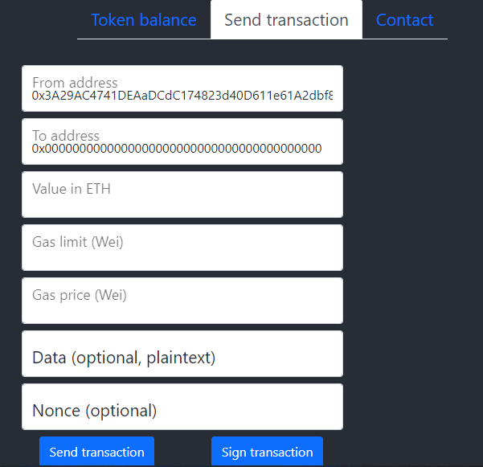
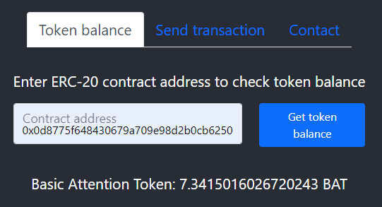

# Eth-interact

This is a web-app for basic interactions with the Ethereum blockchain.

* ## Connect to wallet or client
    * Select a browser wallet, locally running block chain (like [Ganache](https://trufflesuite.com/ganache/index.html)) or any other Ethereum client 
    * Pick an account from the list of available to the wallet/client

* ## Send transaction 
    * Full control over gas limit, gas price and nonce 

    

* ## Check ERC-20 token balance
    * Check token balance for any ERC-20 contract 

    
    
- - - - 

### This project was bootstrapped with [Create React App](https://github.com/facebook/create-react-app).

- Clone the repository and run `npm install`
- Run  `npm start` to start the app in the development mode.
    Open [http://localhost:3000](http://localhost:3000) to view it in your browser.
- ~~Run `npm test` to aunche the test runner in the interactive watch mode.~~
See the section about [running tests](https://facebook.github.io/create-react-app/docs/running-tests) for more information.

-  `npm run build` builds the app for production to the `build` folder.\
It correctly bundles React in production mode and optimizes the build for the best performance.
The build is minified and the filenames include the hashes.\
Your app is ready to be deployed!
See the section about [deployment](https://facebook.github.io/create-react-app/docs/deployment) for more information.
-  `npm run eject` is a one-way operation. Once you `eject`, you can't go back!